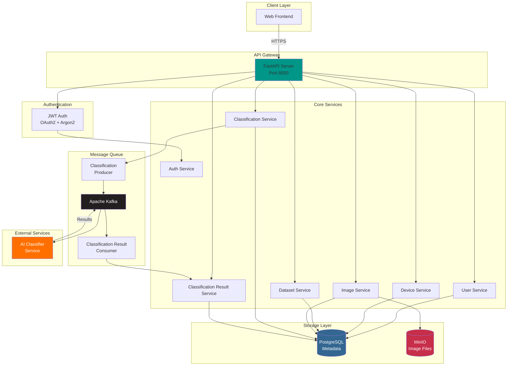
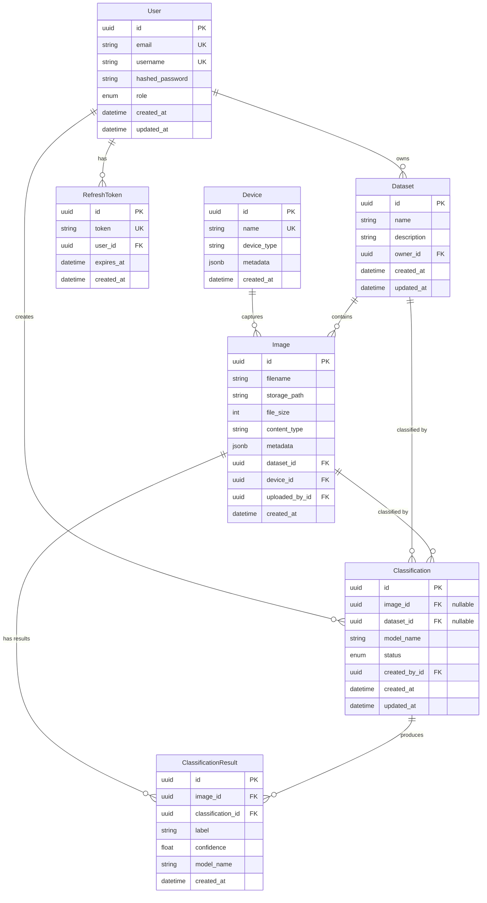

# BioScopeAI Core

[](https://github.com/aleksanderbialka/bioscopeai-core/actions/workflows/main_bioscopeai_core.yml)


Core backend service for BioScopeAI application - a microscopy image classification system powered by AI.

## Overview

BioScopeAI Core is a FastAPI-based backend service that manages microscopy images, runs AI-powered classifications, and provides results through a RESTful API. The system uses an event-driven architecture with Kafka for asynchronous job processing.

## Architecture

### System Overview



### Data Flow

**1. Image Upload Flow:**
```
Client → API → Image Service → MinIO (file) + PostgreSQL (metadata)
```

**2. Classification Request Flow:**
```
Client → API → Classification Service → Kafka Producer → Kafka Topic
→ AI Classifier Service → Processing → Results to Kafka
→ Result Consumer → Result Service → PostgreSQL
```

**3. Query Results Flow:**
```
Client → API → Result Service → PostgreSQL → Response
```

### Tech Stack
- **Framework:** FastAPI (Python 3.13)
- **Database:** PostgreSQL (via Tortoise ORM)
- **Message Queue:** Apache Kafka (bitnami Kafka image)
- **Object Storage:** MinIO (S3-compatible)
- **Authentication:** JWT with OAuth2
- **Password Hashing:** Argon2

### Core Components

- **API Layer:** RESTful endpoints for resource management
- **Authentication:** JWT-based auth with role-based access control (Admin, Analyst, User)
- **Classification Engine:** Kafka-driven async job processing
- **Storage:** MinIO for image files, PostgreSQL for metadata
- **Migrations:** Aerich for database version control

## Features

### Authentication & Authorization
- JWT tokens (access + refresh)
- Role-based permissions (Admin, Analyst, User)
- Service-to-service authentication

### Resource Management
- **Users:** User account management
- **Devices:** Microscopy device registration
- **Datasets:** Image collection organization
- **Images:** Upload, retrieve, and manage microscopy images
- **Classifications:** Run AI models on images/datasets
- **Results:** Store and query classification outputs

### Event-Driven Processing
- Kafka producer for classification jobs
- Kafka consumer for processing results
- Asynchronous job status tracking

## API Endpoints

```
/api/health          - Health check
/api/auth            - Authentication (login, refresh, logout)
/api/users           - User management
/api/devices         - Device management
/api/datasets        - Dataset management
/api/images          - Image upload/retrieval
/api/classifications - Classification jobs
/api/classification-results - Query results
```

## Database Schema

### Entity Relationship Diagram



### Key Models
- **User:** System users with roles
- **Device:** Microscopy devices
- **Dataset:** Collections of images
- **Image:** Individual microscopy images
- **Classification:** Classification jobs (pending/running/completed/failed)
- **ClassificationResult:** AI model predictions with confidence scores

### Relationships
- Images belong to Datasets
- ClassificationResults link to both Images and Classifications
- CASCADE deletes: removing Dataset/Image deletes related Classifications

## Setup

### Prerequisites
- Python 3.13
- PostgreSQL
- Apache Kafka
- MinIO

Services:
- Core API: `localhost:8000`
- API docs: `localhost:8000/api/docs`

## Configuration

Configuration via YAML file (`bioscopeai-core-config.yaml`):

- **App:** Port, CORS, logging level
- **Database:** PostgreSQL connection
- **Kafka:** Brokers, topics
- **S3/MinIO:** Bucket configuration
- **Auth:** JWT keys, token expiration

## Development

### Project Structure
```
bioscopeai_core/
├── app/
│   ├── api/           # API routers and endpoints
│   ├── auth/          # Authentication logic
│   ├── core/          # Configuration, logging
│   ├── crud/          # Database operations
│   ├── db/            # Database initialization
│   ├── kafka/         # Producers and consumers
│   ├── models/        # Tortoise ORM models
│   ├── schemas/       # Pydantic schemas
│   ├── serializers/   # Model-to-schema converters
│   ├── services/      # Business logic
│   └── utils/         # Utilities
├── migrations/        # Database migrations
└── tests/            # Test suite
```

### Code Quality Tools
- **Ruff:** Linting and formatting
- **MyPy:** Type checking
- **Pytest:** Testing framework
- **Pre-commit:** Git hooks

### Running Tests

```bash
source scipts/run_tests.sh
```


## Contact

Maintainer: aleksanderbialka (aleksander.bialka@icloud.com)
