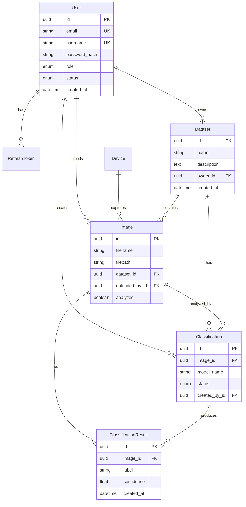

<div align="center">

# 🔬 BioScopeAI Core

**Enterprise-grade backend service for AI-powered microscopy image analysis**

[](https://github.com/aleksanderbialka/bioscopeai-core/actions/workflows/main_bioscopeai_core.yml)
[](https://www.python.org/downloads/)
[](https://fastapi.tiangolo.com)
[](https://github.com/astral-sh/ruff)
[](LICENSE)
[](https://www.postgresql.org/)

[Features](#-key-features) •
[Architecture](#-architecture) •
[Quick Start](#-quick-start) •
[Documentation](#-documentation) •
[API](#-api-documentation)

</div>

---

## 📋 Overview

BioScopeAI Core is a production-ready, cloud-native backend service designed for high-throughput microscopy image analysis. Built with modern async Python technologies, it provides a robust foundation for managing research datasets, coordinating AI-powered image classification workflows, and delivering real-time results through WebSocket connections.

### 🎯 Use Cases

- **Research Labs**: Manage and analyze large-scale microscopy datasets
- **Medical Diagnostics**: Process and classify medical imaging data
- **Industrial QA**: Automated quality inspection of microscopic samples
- **Educational Institutions**: Teaching and training platform for image analysis

---

## ✨ Key Features

### 🔐 Security & Authentication
- **JWT-based authentication** with secure refresh token rotation
- **Argon2 password hashing** - industry-standard cryptographic security
- **Role-based access control (RBAC)** with hierarchical permissions:
  - `ADMIN` - Full system access and user management
  - `RESEARCHER` - Dataset management and analysis execution
  - `ANALYST` - Analysis execution on assigned datasets
  - `VIEWER` - Read-only access to data
- **Email verification** and password reset workflows
- **Session management** with token revocation support

### 🖼️ Image Management
- **Asynchronous file upload** with S3-compatible storage (via boto3)
- **Dataset organization** with ownership and access control
- **Device integration** for direct microscope connectivity
- **Metadata tracking** and analysis status monitoring

### 🤖 AI-Powered Classification
- **Asynchronous task processing** with Kafka message queuing
- **Multiple model support** with configurable confidence thresholds
- **Batch processing** for dataset-level analysis
- **Real-time status updates** via WebSocket connections
- **Result versioning** and confidence score tracking

### 📊 Monitoring & Observability
- **Sentry integration** for error tracking and performance monitoring
- **Structured logging** with Loguru
- **Health check endpoints** for container orchestration
- **Database connection pooling** and query optimization

---

## 🏗️ Architecture

### Technology Stack

| Layer | Technology | Purpose |
|-------|-----------|---------|
| **API Framework** | FastAPI 0.120+ | High-performance async web framework |
| **ORM** | Tortoise ORM 0.25+ | Async ORM with native PostgreSQL support |
| **Database** | PostgreSQL 15+ | Production-grade relational database |
| **Message Queue** | Apache Kafka | Distributed event streaming |
| **Cache/Session** | Redis* | Session storage and caching |
| **Storage** | S3-compatible | Scalable object storage |
| **Authentication** | JWT + OAuth2 | Secure token-based auth |
| **Monitoring** | Sentry | Error tracking and APM |

*Redis integration planned for future releases

### Database Schema



📖 **Detailed schema documentation**: [Database ERD](docs/ERD.md)

### Project Structure

```
bioscopeai-core/
├── bioscopeai_core/           # Main application package
│   ├── app/
│   │   ├── api/               # API layer
│   │   │   ├── routers/       # Endpoint definitions by domain
│   │   │   │   ├── auth/      # Authentication endpoints
│   │   │   │   ├── users/     # User management
│   │   │   │   ├── dataset/   # Dataset CRUD operations
│   │   │   │   ├── image/     # Image upload and retrieval
│   │   │   │   ├── classification/  # Classification workflows
│   │   │   │   └── device/    # Device management
│   │   │   └── api.py         # API router aggregation
│   │   ├── auth/              # Authentication & authorization logic
│   │   ├── core/              # Core configuration and settings
│   │   ├── crud/              # Database operations (CRUD layer)
│   │   ├── db/                # Database configuration and initialization
│   │   ├── kafka/             # Message queue integration
│   │   │   ├── consumers/     # Kafka message consumers
│   │   │   └── producers/     # Kafka message producers
│   │   ├── models/            # Tortoise ORM models
│   │   ├── schemas/           # Pydantic schemas (request/response)
│   │   ├── serializers/       # Data serialization layer
│   │   ├── services/          # Business logic layer
│   │   └── utils/             # Shared utilities and helpers
│   └── tests/                 # Test suite
│       ├── unit/              # Unit tests
│       └── integration/       # Integration tests
├── migrations/                # Aerich database migrations
├── scripts/                   # Utility scripts (deployment, testing)
├── docs/                      # Documentation
│   ├── ERD.md                 # Database schema documentation
│   ├── ERD.mmd                # Mermaid diagram source
│   ├── ERD.puml               # PlantUML diagram source
│   └── ERD.txt                # ASCII diagram
├── .github/
│   └── workflows/             # CI/CD pipeline definitions
├── Dockerfile                 # Container image definition
├── pyproject.toml             # Project metadata and dependencies
└── README.md                  # This file
```

---

## 🚀 Quick Start

### Prerequisites

- **Python 3.13+** - Download from [python.org](https://www.python.org/downloads/)
- **PostgreSQL 15+** - [Installation guide](https://www.postgresql.org/download/)
- **Poetry** - Dependency management tool
  ```bash
  curl -sSL https://install.python-poetry.org | python3 -
  ```
- **Docker** (optional) - For containerized deployment

### Local Development Setup

1. **Clone the repository**
   ```bash
   git clone https://github.com/aleksanderbialka/bioscopeai-core.git
   cd bioscopeai-core
   ```

2. **Install dependencies**
   ```bash
   poetry install
   ```

3. **Configure environment variables**
   ```bash
   cp .env.example .env
   # Edit .env with your configuration
   ```

   Required environment variables:
   ```bash
   # Database
   POSTGRES_USER=postgres
   POSTGRES_PASSWORD=your_secure_password
   POSTGRES_HOST=localhost
   POSTGRES_PORT=5432
   POSTGRES_DB=bioscopeai

   # Security
   SECRET_KEY=your_secret_key_here  # Generate with: openssl rand -hex 32
   DEBUG=True

   # Optional: Sentry
   SENTRY_DSN=your_sentry_dsn
   ```

4. **Initialize the database**
   ```bash
   # Run migrations
   poetry run aerich upgrade
   ```

5. **Start the development server**
   ```bash
   poetry run uvicorn bioscopeai_core.app.main:app --reload --host 0.0.0.0 --port 8000
   ```

6. **Access the API**
   - **API Documentation (Swagger)**: http://localhost:8000/docs
   - **Alternative Documentation (ReDoc)**: http://localhost:8000/redoc
   - **Health Check**: http://localhost:8000/health

### Docker Deployment

1. **Build the Docker image**
   ```bash
   docker build -t bioscopeai-core:latest .
   ```

2. **Run with Docker Compose** (recommended)
   ```bash
   docker-compose up -d
   ```

---

## 🧪 Testing

### Running Tests

```bash
# Run all tests with coverage
poetry run pytest

# Run unit tests only
poetry run pytest -m unit

# Run integration tests
poetry run pytest -m integration

# Generate HTML coverage report
poetry run pytest --cov=bioscopeai_core --cov-report=html
```

### Code Quality

```bash
# Run linter
poetry run ruff check .

# Auto-fix linting issues
poetry run ruff check . --fix

# Type checking
poetry run mypy bioscopeai_core

# Check for dead code
poetry run vulture bioscopeai_core
```

### Pre-commit Hooks

```bash
# Install pre-commit hooks
poetry run pre-commit install

# Run manually
poetry run pre-commit run --all-files
```

---

## 📚 Documentation

### API Documentation

Interactive API documentation is automatically generated and available at:

- **Swagger UI**: `/docs` - Interactive API testing interface
- **ReDoc**: `/redoc` - Clean, three-panel API documentation

### Database Documentation

Comprehensive database schema documentation with multiple formats:

- **[ERD Documentation](docs/ERD.md)** - Full documentation with descriptions
- **[Mermaid Diagram](docs/ERD.mmd)** - For GitHub/VS Code/Mermaid Live
- **[PlantUML Diagram](docs/ERD.puml)** - For enterprise diagramming tools
- **[ASCII Diagram](docs/ERD.txt)** - Terminal-friendly visualization

### Configuration

All configuration is managed through environment variables and the `core/config.py` module. See `.env.example` for a complete list of available options.

---

## 🔄 CI/CD Pipeline

The project uses GitHub Actions for continuous integration and deployment:

### Workflow Stages

1. **Linting** - Code quality checks with Ruff
2. **Build** - Docker image creation
3. **Testing** - Full test suite execution with coverage reporting
4. **Deployment** - Automatic push to GitHub Container Registry (GHCR)

### Badges

- ✅ All tests passing
- 📊 Code coverage reports uploaded as artifacts
- 🐳 Docker images published to GHCR

---

## 🤝 Contributing

Contributions are welcome! Please follow these guidelines:

1. Fork the repository
2. Create a feature branch (`git checkout -b feature/amazing-feature`)
3. Commit your changes (`git commit -m 'Add amazing feature'`)
4. Push to the branch (`git push origin feature/amazing-feature`)
5. Open a Pull Request

### Development Guidelines

- Follow PEP 8 style guide (enforced by Ruff)
- Write comprehensive tests for new features
- Update documentation for API changes
- Ensure all tests pass before submitting PR
- Keep commits atomic and well-described

---

## 📄 License

This project is licensed under the MIT License - see the [LICENSE](LICENSE) file for details.

---

## 👤 Author

**Aleksander Białka**

- Email: aleksander.bialka@icloud.com
- GitHub: [@aleksanderbialka](https://github.com/aleksanderbialka)

---

## 🙏 Acknowledgments

Built with modern Python ecosystem:
- [FastAPI](https://fastapi.tiangolo.com/) - High-performance web framework
- [Tortoise ORM](https://tortoise.github.io/) - Easy async ORM
- [Pydantic](https://pydantic-docs.helpmanual.io/) - Data validation
- [Poetry](https://python-poetry.org/) - Dependency management

---

<div align="center">

**[⬆ Back to Top](#-bioscopeai-core)**

Made with ❤️ for the scientific community

</div>
