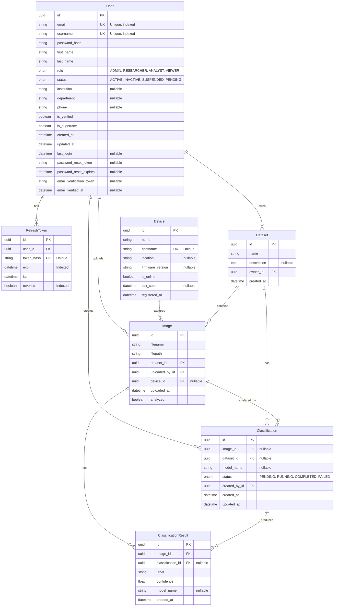

# BioScopeAI Core - Entity Relationship Diagram (ERD)

This document contains the Entity-Relationship Diagram for the BioScopeAI Core database schema.

## ERD Diagram



## Entity Descriptions

### User
Core entity for authentication and authorization. Supports role-based access control with hierarchical roles (ADMIN > RESEARCHER > ANALYST > VIEWER).

**Key Features:**
- Email and username uniqueness
- Password hashing with Argon2
- Role-based permissions
- Account status management
- Email verification workflow
- Password reset functionality

### RefreshToken
Manages JWT refresh tokens for authentication sessions.

**Key Features:**
- Token revocation support
- Expiration tracking
- One-to-many relationship with User

### Device
Represents microscope devices that capture images.

**Key Features:**
- Unique hostname identification
- Online status tracking
- Firmware version management
- Location tracking

### Dataset
Logical grouping of images for analysis and organization.

**Key Features:**
- Owner-based access control
- Contains multiple images
- Can have multiple classification tasks

### Image
Individual microscope images uploaded to the system.

**Key Features:**
- Associated with a dataset
- Tracks uploader and optionally the capture device
- Analysis status tracking
- Multiple classification results

### Classification
Represents a classification task performed on images or datasets.

**Key Features:**
- Can be applied to individual images or entire datasets
- Status tracking (PENDING, RUNNING, COMPLETED, FAILED)
- Model name tracking
- Produces multiple classification results

### ClassificationResult
Individual classification predictions with confidence scores.

**Key Features:**
- Label and confidence score
- Linked to specific images
- Optional association with classification task
- Model tracking

## Relationship Details

### User Relationships
- **User → RefreshToken** (1:N): A user can have multiple active refresh tokens
- **User → Dataset** (1:N): A user owns multiple datasets
- **User → Image** (1:N): A user can upload multiple images
- **User → Classification** (1:N): A user can create multiple classification tasks

### Device Relationships
- **Device → Image** (1:N, optional): A device can capture multiple images

### Dataset Relationships
- **Dataset → Image** (1:N): A dataset contains multiple images
- **Dataset → Classification** (1:N, optional): A dataset can have multiple classification tasks

### Image Relationships
- **Image → Classification** (1:N, optional): An image can be analyzed by multiple classification tasks
- **Image → ClassificationResult** (1:N): An image has multiple classification results

### Classification Relationships
- **Classification → ClassificationResult** (1:N, optional): A classification task produces multiple results

## Enumerations

### UserRole
```python
ADMIN = "admin"         # Level 4 - Full system access
RESEARCHER = "researcher"  # Level 3 - Can perform analysis
ANALYST = "analyst"     # Level 2 - Can perform analysis
VIEWER = "viewer"       # Level 1 - Read-only access
```

### UserStatus
```python
ACTIVE = "active"       # Active account
INACTIVE = "inactive"   # Inactive account
SUSPENDED = "suspended" # Suspended account
PENDING = "pending"     # Pending verification
```

### ClassificationStatus
```python
PENDING = "pending"     # Queued for processing
RUNNING = "running"     # Currently processing
COMPLETED = "completed" # Successfully completed
FAILED = "failed"       # Processing failed
```

## Database Technology

- **ORM:** Tortoise ORM
- **Database:** PostgreSQL (via asyncpg)
- **Migration Tool:** Aerich

## Notes

1. All primary keys are UUIDs for better scalability and security
2. Foreign key relationships use Tortoise ORM's `ForeignKeyField`
3. Many relationships are nullable to support flexible workflows
4. Timestamps use `auto_now_add` and `auto_now` for automatic management
5. Indexes are applied to frequently queried fields (email, username, token expiration, revoked status)
